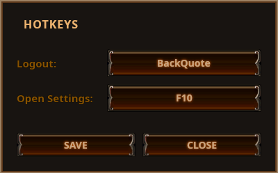

# PoE Kompanion
A small utility for PoE on Linux, currently only containing a Logout Macro.
Aim to be a replacement to Lutcikaur's amazing [LutBot](http://lutbot.com).

## Screenshots




## System Requirements

PoE Kompanion is distributed as an AppImage and requires FUSE to run.

### Installing FUSE

- **Arch/Manjaro/CachyOS**: `sudo pacman -S fuse3` (or `fuse2`)
- **Ubuntu/Debian**: `sudo apt install fuse`
- **Fedora**: `sudo dnf install fuse`

### Troubleshooting: Bus Error on Startup

If you encounter a "Bus error" when running the AppImage, this is due to an incompatibility between .NET AOT-compiled binaries and FUSE mounts on some systems.

**Solution**: Install AppImage binfmt_misc support (one-time setup):

```bash
sudo ./setup-appimage-support.sh
```

This registers AppImages with the kernel's binfmt_misc system, which resolves the bus error issue.

**Alternative solutions:**
1. Install [AppImageLauncher](https://github.com/TheAssassin/AppImageLauncher) - it includes the same binfmt registration
2. Run with auto-extraction (slower startup): `./PoE-Kompanion-x86_64.AppImage --appimage-extract-and-run`

## Building from Source

### Prerequisites

- Docker (for AppImage builds)
- .NET 9.0 SDK (for manual builds)

### Build AppImage (Recommended)

Build a portable AppImage using Docker (ensures maximum compatibility across Linux distributions):

```bash
./build-appimage-docker.sh
```

This creates a portable AppImage that works on most Linux distributions by building in a Debian 11 container with glibc 2.31.

**What it does:**
- Builds in an isolated Debian 11 container for maximum compatibility
- Automatically bundles all required dependencies using linuxdeploy
- Produces a single executable AppImage file
- No pollution of your working directory

### Build Manually

For development or if you don't have Docker:

```bash
dotnet publish -r linux-x64 -c Release --self-contained
```

The compiled binary will be in `bin/Release/net9.0/linux-x64/publish/`

**Note:** Manual builds may not be portable across different Linux distributions due to glibc version differences. Use the Docker build for distribution.